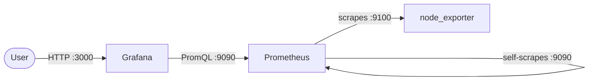

# Scenario 2

I used Ansible to install Prometheus, Grafana, and node_exporter on the Fanap VM.

## Architecture



## Code

### Playbook & Roles

I have only one role named `monitoring`.

- main.yml: checks the SSH connection and runs the `monitoring` role.
- install.yml: installs Prometheus, node_exporter, and Grafana.
- prometheus.yml: adds Prometheus scrape targets for Prometheus and node_exporter.
- grafana.yml: adds the Prometheus datasource and the CPU and memory dashboard.
- services.yml: enables and starts Prometheus, node_exporter, and Grafana.
- handlers/main.yml: restarts Prometheus or Grafana only when their configuration changes.

### Inventory

My inventory contains only the fanap vm.

## Credentials / Login

```text
# Grafana
user: admin
pass: admin
```

Grafana: `http://IP:3000`

Prometheus: `http://IP:9090`

## Challenges

I had no special challenges in this scenario.
